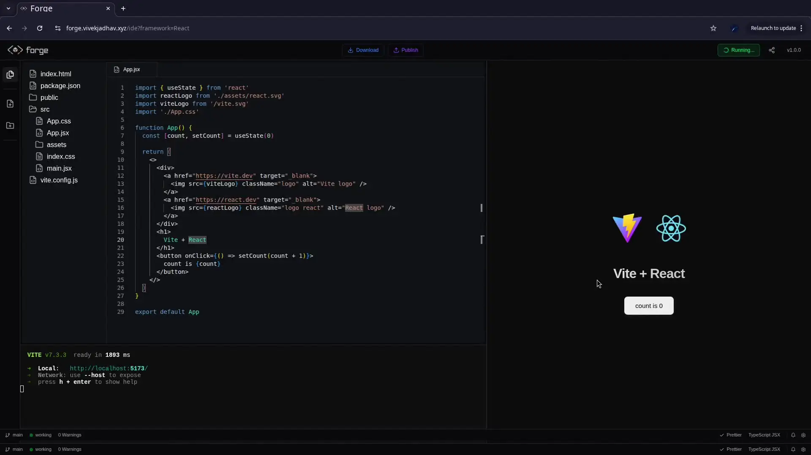

<div align="center">

<p align="center">
  <a href="https://github.com/user-attachments/assets/3fdeb5ad-e832-4bbf-a879-bb22c35d0ea0">
    
  </a>
</p>

# Forge

**A full IDE in your browser. No install. No server. Just code.**

[**→ Try it live**](https://forge.vivekjadhav.xyz) · [Report a bug](https://github.com/vivek1504/forge/issues) · [Request a feature](https://github.com/vivek1504/forge/issues)

<p align="center">
  
  
  
  
</p>

</div>

---

> If Forge is useful to you, a ⭐ helps others find it — thank you!

---

## What is this?

Forge is a browser-based development environment powered by WebContainers.

It runs a real Node.js runtime directly inside your browser tab, allowing you to create, edit, install dependencies, and run projects entirely client-side.

There’s no backend server, remote VM, or Docker container involved.

Pick a framework, start coding instantly, and see live updates with hot reload - all from a single URL.

---

## Features

- **Zero setup** — open the URL and you're coding in seconds
- **Real runtime** — actual Node.js in the browser, not a sandbox simulator
- **Live preview** — HMR-powered preview updates as you type
- **Monaco editor** — the same editor that powers VS Code
- **Integrated terminal** — full xterm.js terminal, not a fake console
- **File explorer** — create, rename, and delete files like a real IDE
- **Download as zip** — export your project and keep working locally
- **100% client-side** — no server, no accounts, no data sent anywhere

---

## Architecture

Forge runs entirely inside the browser using WebContainers.

- Monaco Editor powers the editing experience
- xterm.js provides the terminal interface
- WebContainers boot a real Node.js runtime in-browser
- Vite powers instant HMR and preview updates
- Jotai manages IDE state and file synchronization

Everything executes client-side — no server orchestration layer exists.

---
## Tech stack

| Layer | Library |
|-------|---------|
| Framework | React 19 + TypeScript |
| Editor | Monaco Editor |
| Terminal | xterm.js |
| Runtime | WebContainers API |
| Build | Vite 7 |
| Styling | TailwindCSS 4 |
| State | Jotai |
| Routing | React Router v7 |
| Animations | Framer Motion |

---

## Supported frameworks

| Framework | Status |
|-----------|--------|
| React + Vite | ✅ |
| Vue + Vite | ✅ |
| Svelte + Vite | ✅ |
| Node.js | ✅ |
| Next.js | 🔜 Coming soon |
| Remix | 🔜 Coming soon |

---

## Project structure

```
src/
├── components/
│   ├── CodeEditor.tsx        # Monaco editor wrapper
│   ├── Terminal.tsx          # xterm.js terminal
│   ├── Sidebar.tsx           # File explorer
│   ├── PreviewFrame.tsx      # Live preview iframe
│   ├── IdeHeader.tsx
│   └── IdeFooter.tsx
├── lib/
│   ├── webContainerRuntime.ts    # WebContainer setup & lifecycle
│   ├── webContainerManager.ts    # Instance management
│   ├── projectFiles.ts           # Framework templates
│   ├── atoms.ts                  # Jotai state
│   └── utils.ts
└── pages/
    ├── LandingPage.tsx
    └── IDEpage.tsx
```
---

## Run it locally

```bash
git clone https://github.com/vivek1504/forge.git
cd forge
npm install
npm run dev
```

Open `http://localhost:5173`.

> **Note:** WebContainers require `Cross-Origin-Isolation` headers (`COOP` + `COEP`). The dev server sets these automatically via the Vite config.

---
## Limitations

Because Forge runs entirely in the browser through WebContainers:

- Best supported in Chromium-based browsers
- Native binaries are not supported
- Large dependency installs may impact memory usage
- Some Node.js APIs behave differently from native environments

---

## Roadmap

- [ ] Next.js template
- [ ] Remix support
- [ ] Multi-tab editing
- [ ] Persistent local storage
- [ ] Git integration
- [ ] Collaborative editing

---

## Contributing

PRs are welcome — especially for new framework templates and bug fixes.

- **New framework template?** → `src/lib/projectFiles.ts` is where templates live
- **Testing:** Run `npm run dev` and verify HMR, terminal, and file explorer work end-to-end in Chrome (WebContainers have best support there)

If you're unsure whether something is worth building, open an issue first and let's talk.

---

## License

MIT — do whatever you want with it.
